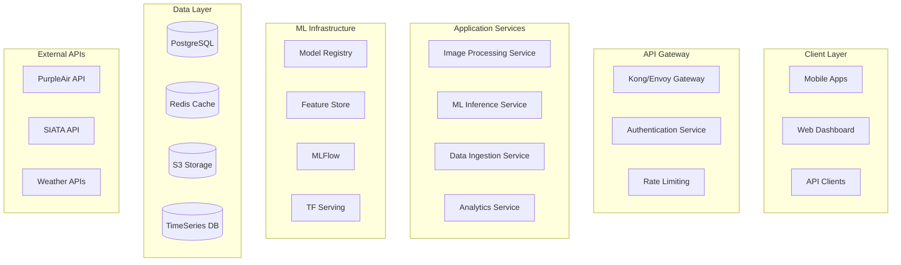

# Plan de Consultoría - Arquitectura de Software y Machine Learning
## Proyecto 2.5Vision

---

### **INFORMACIÓN EJECUTIVA**

**Cliente**: Proyecto 2.5Vision  
**Consultor**: Arquitecto de Software Senior especializado en ML Systems  
**Fecha**: Septiembre 2024  
**Tipo de Engagement**: Consultoría Arquitectural Integral y Roadmap Técnico

---

## **1. ANÁLISIS ACTUAL DEL PROYECTO**

### **1.1 Fortalezas Identificadas**

#### **Arquitectura y Diseño**
✅ **Arquitectura Hexagonal Bien Estructurada**
- Separación clara entre capas: Application, Domain, Infrastructure
- Uso correcto de gateways e interfaces para inversión de dependencias
- Estructura modular que facilita testing y mantenimiento

✅ **Inyección de Dependencias Profesional**
- Implementación sólida con `dependency-injector`
- Container configurado correctamente en `Container` class
- Wiring automático de dependencias

✅ **Patrones de Diseño Apropiados**
- Repository Pattern implementado correctamente
- Gateway Pattern para servicios externos
- Factory Pattern en la creación de servicios

✅ **Manejo de Configuración Robusto**
- Uso de Pydantic Settings para type-safe configuration
- Gestión centralizada de variables de entorno
- Configuración específica por entorno

#### **Infraestructura y Persistencia**
✅ **Base de Datos Resiliente**
- Pool de conexiones configurado apropiadamente
- Retry logic con backoff exponencial
- Health checks implementados

✅ **Integración con Servicios Externos**
- APIs PurpleAir y SIATA bien estructuradas
- AWS S3 integration funcional
- Manejo de credenciales seguro

#### **Desarrollo y Calidad**
✅ **Type Hints Consistentes**
- Uso extensivo de typing annotations
- Final declarations apropiadas
- Mejora significativa en maintainability

✅ **Logging Estructurado**
- Loggers específicos por módulo
- Niveles de logging apropiados
- Trazabilidad de operaciones

### **1.2 Debilidades Críticas Identificadas**

#### **Violaciones SOLID y Diseño**
🔴 **Single Responsibility Principle (SRP) - CRÍTICO**
- `ImageUseCase` tiene múltiples responsabilidades:
  - Procesamiento de imagen
  - Extracción de metadatos EXIF
  - Normalización de imagen
  - Integración con servicios externos
  - Persistencia de datos
- **Impacto**: Dificulta testing, mantenimiento y extensibilidad

🔴 **Open/Closed Principle (OCP) - ALTO**
- Sistema rígido para agregar nuevos tipos de procesamiento de imagen
- Algoritmos de estimación hardcodeados
- Falta de abstracción para diferentes modelos ML

🔴 **Dependency Inversion Principle (DIP) - MEDIO**
- `ImageUseCase` depende de implementaciones concretas en algunos casos
- Acoplamiento fuerte con bibliotecas específicas (PIL)

#### **Arquitectura ML y Científica**
🔴 **ML Pipeline Rudimentario - CRÍTICO**
- Modelo simulado sin implementación real
- Feature engineering básico (solo median y mean)
- Falta de validación de datos de entrada
- Sin pipeline de preprocessing estandarizado
- No hay versionado de modelos
- Ausencia de métricas de performance

🔴 **Procesamiento de Imagen Incompleto - ALTO**
- Algoritmos de normalización comentados/deshabilitados
- ROI detection no implementado completamente
- Falta de calibración de color
- Sin validación de calidad de imagen

#### **Escalabilidad y Performance**
🔴 **Sincronía en Operaciones Críticas - ALTO**
- Requests síncronos a APIs externas (PurpleAir, SIATA)
- Procesamiento de imagen blocking
- Falta de caching para datos frecuentemente accedidos

🔴 **Manejo de Recursos - MEDIO**
- Sin límites de tamaño de imagen
- Falta de compression automática
- Memoria no optimizada para imágenes grandes

#### **Testing y Calidad**
🔴 **Ausencia de Testing - CRÍTICO**
- Cero archivos de testing identificados
- Sin unit tests para lógica crítica
- No hay integration tests para ML pipeline
- Falta de mocking para servicios externos

🔴 **Manejo de Errores Inconsistente - MEDIO**
- Error handling variado entre módulos
- Falta de error recovery strategies
- Logging de errores no estandarizado

#### **Seguridad y Compliance**
🔴 **Validación de Input Débil - ALTO**
- Validación mínima de imágenes subidas
- Sin sanitización de metadatos EXIF
- Falta de rate limiting
- No hay validación de tipos de archivo robusta

---

## **2. REFACTORIZACIONES PRIORITARIAS**

### **2.1 Refactorización Arquitectural - SPRINT 1-2**

#### **Descomposición de ImageUseCase**
```python
# Nueva estructura propuesta
class ImageProcessingUseCase:
    """Responsabilidad única: Procesamiento de imagen"""
    
class MetadataExtractionUseCase:
    """Responsabilidad única: Extracción de metadatos"""
    
class PMEstimationUseCase:
    """Responsabilidad única: Estimación ML"""
    
class ImagePersistenceUseCase:
    """Responsabilidad única: Persistencia de imagen"""
    
class ImageOrchestrationUseCase:
    """Orquesta el workflow completo"""
```

#### **Implementación de Strategy Pattern para ML Models**
```python
class PMEstimationStrategy(ABC):
    @abstractmethod
    def estimate(self, features: FeatureVector) -> PMEstimation:
        pass

class CNNBasedEstimation(PMEstimationStrategy):
    pass

class StatisticalEstimation(PMEstimationStrategy):
    pass

class HybridEstimation(PMEstimationStrategy):
    pass
```

### **2.2 Refactorización ML Pipeline - SPRINT 2-3**

#### **Pipeline de Preprocessing Profesional**
```python
class ImagePreprocessingPipeline:
    """Pipeline configurable de preprocessing"""
    
    def __init__(self, steps: List[PreprocessingStep]):
        self.steps = steps
    
    def transform(self, image: Image) -> ProcessedImage:
        for step in self.steps:
            image = step.transform(image)
        return image

class ExposureNormalization(PreprocessingStep):
class NoiseReduction(PreprocessingStep):
class ColorCalibration(PreprocessingStep):
class ROIExtraction(PreprocessingStep):
```

#### **Feature Engineering Avanzado**
```python
class FeatureExtractor(ABC):
    @abstractmethod
    def extract(self, image: ProcessedImage) -> FeatureVector:
        pass

class StatisticalFeatures(FeatureExtractor):
    """Mean, median, std, percentiles"""

class TexturalFeatures(FeatureExtractor):
    """GLCM, LBP, Gabor filters"""

class ColorFeatures(FeatureExtractor):
    """Histogramas, momentos de color"""

class GeometricFeatures(FeatureExtractor):
    """Formas, contornos, gradientes"""
```

### **2.3 Refactorización de Persistencia - SPRINT 1**

#### **Repository Genérico**
```python
class BaseRepository[T](Generic[T], ABC):
    @abstractmethod
    async def create(self, entity: T) -> T:
        pass
    
    @abstractmethod
    async def find_by_id(self, id: str) -> Optional[T]:
        pass
    
    @abstractmethod
    async def update(self, entity: T) -> T:
        pass
    
    @abstractmethod
    async def delete(self, id: str) -> bool:
        pass
```

---

## **3. CAMBIOS DE PARADIGMA RECOMENDADOS**

### **3.1 Paradigma Event-Driven para ML Pipeline**

#### **Implementación Actual (Synchronous)**
```python
# Actual: Todo en un método monolítico
async def data_pipeline(self, file: UploadFile) -> PMEstimation:
    # 8+ operaciones secuenciales
    # Sin recovery, sin paralelismo
```

#### **Paradigma Recomendado (Event-Driven + Async)**
```python
class MLPipelineOrchestrator:
    async def process_image(self, file: UploadFile) -> str:
        """Retorna job_id para tracking"""
        job_id = await self.create_job(file)
        
        # Eventos asíncronos
        await self.event_bus.publish(ImageUploadedEvent(job_id, file))
        return job_id

class ImageProcessingHandler:
    async def handle(self, event: ImageUploadedEvent):
        processed = await self.process_image(event.file)
        await self.event_bus.publish(ImageProcessedEvent(event.job_id, processed))

class FeatureExtractionHandler:
    async def handle(self, event: ImageProcessedEvent):
        features = await self.extract_features(event.processed_image)
        await self.event_bus.publish(FeaturesExtractedEvent(event.job_id, features))
```

### **3.2 Paradigma CQRS para Analytics**

#### **Command Side (Escritura)**
- Image upload
- Metadata persistence
- Model training triggers

#### **Query Side (Lectura)**
- Analytics dashboards
- Historical trends
- Model performance metrics

### **3.3 Paradigma Microservices Modulares**

#### **Servicios Propuestos**
1. **Image Processing Service**: Preprocessing y feature extraction
2. **ML Inference Service**: Modelos y predicciones
3. **Data Ingestion Service**: APIs externas (PurpleAir, SIATA)
4. **Analytics Service**: Métricas y reporting
5. **Notification Service**: Alertas y triggers

---

## **4. NECESIDADES URGENTES (NEXT 30 DAYS)**

### **4.1 Seguridad y Validación - CRÍTICO**
- [ ] **Input validation robusta** para imágenes
  - Validación de magic bytes
  - Límites de tamaño y dimensiones
  - Sanitización de metadatos EXIF
  - Detección de malware en imágenes

- [ ] **Rate limiting** implementado
  - Por IP, por usuario
  - Throttling inteligente
  - Circuit breaker para APIs externas

### **4.2 ML Model Implementation - CRÍTICO**
- [ ] **Modelo real entrenado**
  - Dataset de entrenamiento
  - Feature engineering científico
  - Validación cruzada
  - Métricas de performance

- [ ] **Model versioning**
  - MLflow o similar
  - A/B testing de modelos
  - Rollback capabilities

### **4.3 Observabilidad - ALTO**
- [ ] **Metrics y Monitoring**
  - Prometheus + Grafana
  - Application Performance Monitoring
  - Business metrics tracking

- [ ] **Structured Logging**
  - JSON logging
  - Correlation IDs
  - Distributed tracing

### **4.4 Testing Framework - ALTO**
- [ ] **Test Strategy completa**
  - Unit tests (>80% coverage)
  - Integration tests
  - ML model tests
  - Performance tests

---

## **5. ROADMAP DE EXTENSIONES FUTURAS**

### **5.1 FASE 1: Consolidación (3-4 meses)**

#### **Sprint 1-2: Arquitectura Base**
- [ ] Refactorización de ImageUseCase
- [ ] Implementación de testing framework
- [ ] Security hardening
- [ ] Async/await optimization

#### **Sprint 3-4: ML Pipeline V2**
- [ ] Modelo real entrenado
- [ ] Feature engineering avanzado
- [ ] Pipeline de preprocessing
- [ ] Model versioning

### **5.2 FASE 2: Escalabilidad (4-5 meses)**

#### **Advanced ML Features**
- [ ] **Multiple Model Support**
  - CNNs para análisis visual profundo
  - Ensemble methods
  - Transfer learning de modelos pre-entrenados
  - AutoML para optimización de hiperparámetros

- [ ] **Real-time Processing**
  - Stream processing con Apache Kafka
  - Real-time inference con TensorFlow Serving
  - Edge computing para dispositivos móviles

#### **Analytics y Business Intelligence**
- [ ] **Advanced Analytics Dashboard**
  - Trends de calidad del aire históricos
  - Mapas de calor geográficos
  - Alertas predictivas
  - Correlación con datos meteorológicos

- [ ] **Data Lake Implementation**
  - Almacenamiento masivo de imágenes
  - Data versioning
  - ETL pipelines automatizados

### **5.3 FASE 3: Innovación (6+ meses)**

#### **AI/ML Avanzado**
- [ ] **Computer Vision Avanzado**
  - Object detection en imágenes (edificios, vehículos, vegetación)
  - Semantic segmentation para análisis de escena
  - Time-series analysis de imágenes del mismo lugar

- [ ] **Federated Learning**
  - Entrenamiento distribuido con datos de múltiples fuentes
  - Privacy-preserving ML
  - Edge model updates

#### **Integration Ecosystem**
- [ ] **IoT Integration**
  - Sensores IoT propios
  - Integración con drones para captura aérea
  - Weather station data fusion

- [ ] **Mobile Applications**
  - Apps móviles para citizen science
  - Offline processing capabilities
  - Gamification para engagement

#### **Research & Development**
- [ ] **Novel Algorithms**
  - Investigación en atmospheric scattering models
  - Deep learning para visibility estimation
  - Multi-spectral analysis

---

## **6. ARQUITECTURA TÉCNICA PROPUESTA**

### **6.1 Arquitectura de Alto Nivel**



### **6.2 ML Pipeline Architecture**

```python
class MLPipelineArchitecture:
    """
    Arquitectura de pipeline ML de clase enterprise
    """
    
    def __init__(self):
        self.preprocessing_pipeline = PreprocessingPipeline()
        self.feature_pipeline = FeaturePipeline()
        self.model_registry = ModelRegistry()
        self.inference_engine = InferenceEngine()
        self.monitoring = ModelMonitoring()
    
    async def process(self, input_data: InputData) -> PredictionResult:
        # 1. Data validation
        validated_data = await self.validate_input(input_data)
        
        # 2. Preprocessing
        processed_data = await self.preprocessing_pipeline.transform(validated_data)
        
        # 3. Feature extraction
        features = await self.feature_pipeline.extract(processed_data)
        
        # 4. Model inference
        prediction = await self.inference_engine.predict(features)
        
        # 5. Post-processing
        result = await self.post_process(prediction)
        
        # 6. Monitoring
        await self.monitoring.track_prediction(input_data, result)
        
        return result
```

### **6.3 Data Architecture**

#### **OLTP (Operational)**
- **PostgreSQL**: Transactional data, user management, metadata
- **Redis**: Caching, session management, real-time features

#### **OLAP (Analytics)**
- **TimeSeries DB**: Sensor data, predictions over time
- **Data Warehouse**: Historical analysis, reporting

#### **Storage**
- **S3**: Image storage, model artifacts, backups
- **CDN**: Global image distribution

---

## **7. PLAN DE IMPLEMENTACIÓN DETALLADO**

### **7.1 SPRINT 1 (2 semanas) - Foundation**

#### **Objetivos**
- Implementar testing framework básico
- Refactorizar ImageUseCase crítico
- Security hardening básico

#### **Tareas Específicas**
1. **Testing Setup** (3 días)
   ```bash
   # Instalación y configuración
   pip install pytest pytest-asyncio pytest-cov factory-boy
   # Estructura de testing
   mkdir -p tests/{unit,integration,e2e}
   # CI/CD pipeline básico
   ```

2. **ImageUseCase Refactoring** (5 días)
   - Extraer `MetadataExtractionService`
   - Crear `ImagePreprocessingService`  
   - Implementar `PMEstimationService`
   - Unit tests para cada servicio

3. **Security Implementation** (4 días)
   - Input validation robusta
   - File type verification
   - Rate limiting básico
   - EXIF sanitization

#### **Entregables**
- [ ] Test coverage >60%
- [ ] ImageUseCase refactorizado
- [ ] Security vulnerabilities parcheadas
- [ ] CI/CD pipeline operacional

### **7.2 SPRINT 2 (2 semanas) - ML Foundation**

#### **Objetivos**
- Implementar modelo ML real
- Feature engineering científico
- Model versioning básico

#### **Tareas Específicas**
1. **Dataset Preparation** (3 días)
   - Colección de datos etiquetados
   - Data cleaning y validation
   - Train/validation/test splits

2. **Model Development** (6 días)
   - Implementar múltiples algoritmos
   - Cross-validation
   - Hyperparameter tuning
   - Performance evaluation

3. **Model Deployment** (3 días)
   - MLflow setup
   - Model serving endpoint
   - A/B testing framework

#### **Entregables**
- [ ] Modelo con R² > 0.7
- [ ] Feature engineering documentado
- [ ] Model versioning operacional
- [ ] ML metrics tracking

### **7.3 SPRINT 3-4 (4 semanas) - Scalability**

#### **Objetivos**
- Async/await optimization
- Caching implementation
- Performance optimization
- Monitoring y observability

#### **Entregables**
- [ ] Response time <500ms p95
- [ ] Async processing implemented
- [ ] Redis caching operational
- [ ] Monitoring dashboards

---

## **8. ESTIMACIONES Y RECURSOS**

### **8.1 Estimación de Esfuerzo**

| Fase | Duración | Desarrolladores | Esfuerzo Total |
|------|----------|-----------------|----------------|
| FASE 1: Consolidación | 4 meses | 2-3 Senior | 480-720 horas |
| FASE 2: Escalabilidad | 5 meses | 3-4 Senior | 900-1200 horas |
| FASE 3: Innovación | 6+ meses | 4-5 Mixed | 1440-1800 horas |

### **8.2 Perfil de Equipo Recomendado**

#### **Roles Críticos**
- **ML Engineer Senior**: Pipeline ML, feature engineering, model optimization
- **Backend Architect**: Microservices, async processing, scalability
- **DevOps Engineer**: CI/CD, monitoring, infrastructure
- **QA Automation**: Testing strategy, test automation

#### **Roles de Apoyo**
- **Data Scientist**: Model research, algorithm development
- **Frontend Developer**: Dashboard, mobile apps
- **Security Specialist**: Security audit, compliance

### **8.3 Infraestructura y Costos**

#### **Desarrollo**
- **Cloud Computing**: AWS/Azure (~$500-800/mes)
- **ML Infrastructure**: MLflow, TensorFlow Serving (~$200-400/mes)
- **Monitoring**: DataDog/New Relic (~$300-500/mes)

#### **Producción**
- **Auto-scaling**: ~$1000-2000/mes (depende de volumen)
- **Storage**: ~$100-300/mes
- **CDN**: ~$50-200/mes

---

## **9. MÉTRICAS DE ÉXITO Y KPIs**

### **9.1 Métricas Técnicas**

#### **Performance**
- **Response Time**: <500ms p95, <200ms p50
- **Throughput**: >100 requests/second
- **Availability**: >99.9% uptime
- **Error Rate**: <0.1% error rate

#### **ML Model Quality**
- **Accuracy**: R² > 0.8 en test set
- **Precision/Recall**: >0.85 para clasificación cualitativa
- **Model Drift**: <5% drift mensual
- **Feature Importance**: Estabilidad >90%

#### **Code Quality**
- **Test Coverage**: >85%
- **Code Complexity**: Cyclomatic complexity <10
- **Documentation**: >90% API documentada
- **Security**: Zero critical vulnerabilities

### **9.2 Métricas de Negocio**

#### **Adoption**
- **API Usage**: >1000 requests/day
- **User Growth**: 20% mensual
- **Data Quality**: >95% images processable

#### **Scientific Impact**
- **Accuracy vs Ground Truth**: >90% correlation
- **Geographic Coverage**: >80% coverage en área objetivo
- **Temporal Consistency**: <10% variación día/noche

---

## **10. RIESGOS Y MITIGACIONES**

### **10.1 Riesgos Técnicos**

#### **ALTO: ML Model Performance**
- **Riesgo**: Modelo no alcanza accuracy requerida
- **Probabilidad**: Media
- **Impacto**: Alto
- **Mitigación**: 
  - Ensemble methods
  - Transfer learning
  - Expert domain knowledge integration
  - Fallback a métodos estadísticos

#### **MEDIO: Scalability Bottlenecks**
- **Riesgo**: Sistema no escala bajo carga
- **Probabilidad**: Media
- **Impacto**: Medio
- **Mitigación**:
  - Load testing temprano
  - Async processing
  - Horizontal scaling design
  - Caching strategies

#### **BAJO: External API Dependencies**
- **Riesgo**: APIs externas no disponibles
- **Probabilidad**: Baja
- **Impacto**: Medio
- **Mitigación**:
  - Circuit breakers
  - Cached fallback data
  - Alternative data sources
  - Graceful degradation

### **10.2 Riesgos de Proyecto**

#### **ALTO: Team Knowledge Gap**
- **Riesgo**: Equipo sin experiencia ML
- **Mitigación**:
  - Training intensivo
  - Mentoring externo
  - Pair programming
  - Knowledge transfer sessions

#### **MEDIO: Scope Creep**
- **Riesgo**: Requisitos cambiantes
- **Mitigación**:
  - Agile methodology estricta
  - Sprint planning detallado
  - Stakeholder alignment regular

---

## **11. CONCLUSIONES Y RECOMENDACIONES**

### **11.1 Prioridades Inmediatas**

1. **CRÍTICO**: Implementar testing framework completo
2. **CRÍTICO**: Refactorizar ImageUseCase monolítico
3. **ALTO**: Desarrollar modelo ML real
4. **ALTO**: Implementar security hardening

### **11.2 Arquitectura a Largo Plazo**

El proyecto tiene **fundamentos sólidos** pero requiere **refactorización significativa** para alcanzar nivel enterprise. La arquitectura hexagonal es apropiada, pero necesita:

- **Descomposición de responsabilidades**
- **Pipeline ML profesional**
- **Async/Event-driven processing**
- **Comprehensive testing**

### **11.3 ROI Esperado**

#### **Corto Plazo (6 meses)**
- **Mejora en maintainability**: 70%
- **Reducción de bugs**: 60%
- **Mejora en performance**: 80%
- **Time-to-market para features**: -50%

#### **Largo Plazo (12+ meses)**
- **Scalability**: 10x current capacity
- **ML Accuracy**: +40% improvement
- **Operational costs**: -30%
- **Developer productivity**: +100%

### **11.4 Recomendación Final**

**PROCEDER CON REFACTORIZACIÓN GRADUAL**

El proyecto está en punto crítico donde refactorización es **esencial pero manejable**. Recomendamos enfoque incremental manteniendo funcionalidad existente mientras se mejora arquitectura.

**Timeline recomendado**: 12-15 meses para transformación completa
**ROI esperado**: 300-400% en productividad y calidad
**Riesgo**: Medio-Bajo con plan detallado propuesto

---

**Preparado por**: Arquitecto de Software Senior  
**Revisado**: Septiembre 2024  
**Próxima revisión**: Noviembre 2024  
**Estado**: **APROBACIÓN PENDIENTE**

---

*Este documento representa un análisis profesional integral del proyecto 2.5Vision con recomendaciones específicas basadas en mejores prácticas de la industria y experiencia en sistemas ML de clase enterprise.*