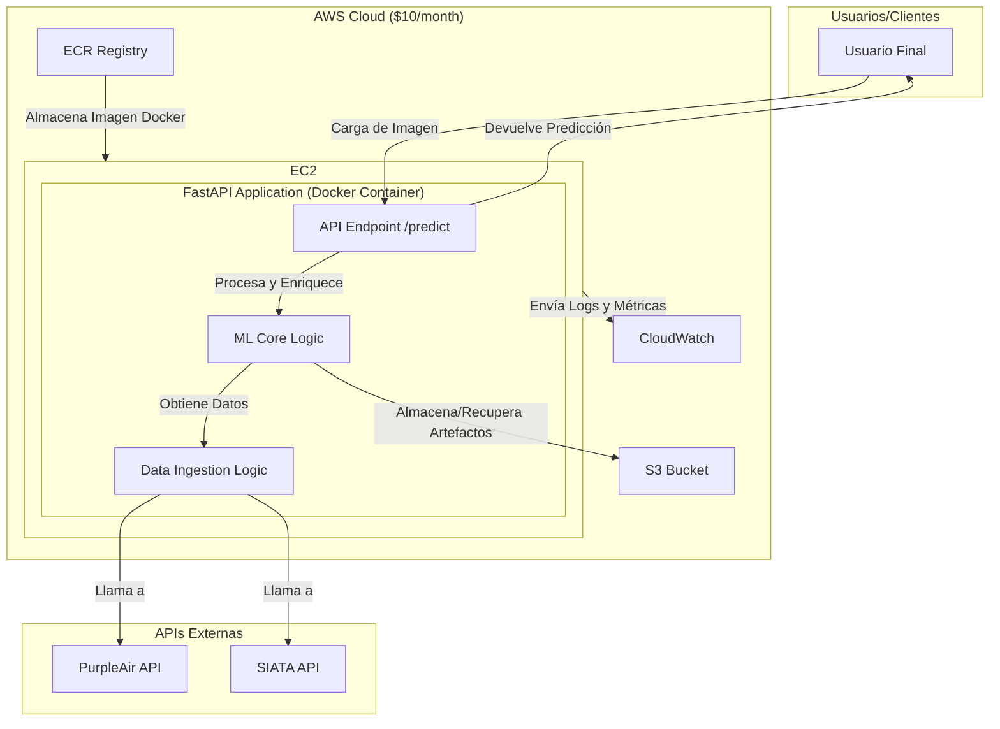

# Diagrama del Sistema - 2.5Vision

Este documento contiene el diagrama de arquitectura principal del sistema, definido durante la Fase 0.

```mermaid
graph TB
    subgraph "Usuarios/Clientes"
        User[Usuario Final]
    end

    subgraph "AWS Cloud ($10/month)"
        EC2[EC2 t3.micro]

        subgraph EC2
            subgraph "FastAPI Application (Docker Container)"
                API[API Endpoint /predict]
                MLCore[ML Core Logic]
                DataIngestion[Data Ingestion Logic]
            end
        end

        S3[S3 Bucket]
        CloudWatch[CloudWatch]
        ECR[ECR Registry]
    end

    subgraph "APIs Externas"
        PurpleAir[PurpleAir API]
        SIATA[SIATA API]
    end

    User -- Carga de Imagen --> API
    API -- Procesa y Enriquece --> MLCore
    MLCore -- Obtiene Datos --> DataIngestion
    DataIngestion -- Llama a --> PurpleAir
    DataIngestion -- Llama a --> SIATA
    MLCore -- Almacena/Recupera Artefactos --> S3
    API -- Devuelve Predicción --> User
    EC2 -- Envía Logs y Métricas --> CloudWatch
    ECR -- Almacena Imagen Docker --> EC2
```
