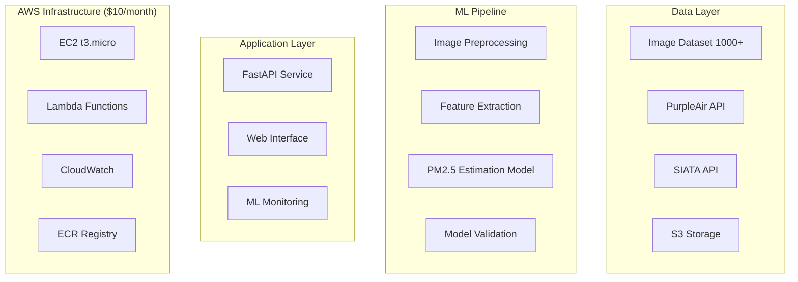

# GUÍA DEFINITIVA: PROYECTO 2.5VISION

## De Básico a ML Engineer Avanzado - Proyecto Insignia

---

## FILOSOFÍA DEL PROYECTO

> **Justificación de la Filosofía:**
> Este proyecto no es solo sobre construir un software, es sobre construir un **experto**. Los análisis previos (`PLAN_CONSULTORÍA` y `ANÁLIS_ARQUITECTURAL`) revelaron brechas significativas en MLOps y diseño de sistemas. Esta filosofía aborda esas brechas de frente.
> - **Learning-First:** Convierte la "falta de experiencia" de un riesgo a la métrica principal de éxito. Cada tarea está diseñada para enseñar un concepto de nivel industrial.
> - **Portfolio-Ready:** El objetivo es crear un proyecto tan bien documentado y estructurado que hable por sí mismo en una entrevista o presentación a inversores.
> - **Cost-Efficient:** Elimina la barrera de entrada. Demuestra que se puede construir un sistema de ML de alta calidad sin un gran presupuesto, una habilidad muy valorada en startups y entornos lean.
> - **Industry-Standard:** Se enfoca en tecnologías y prácticas (Terraform, PyTorch, Ensemble Learning) que son directamente transferibles a un rol de ML Engineer de alto nivel.

### Objetivo Principal: 
Crear un sistema ML de clase mundial para estimación de PM2.5 que sirva como:
- Tu transición de básico a avanzado en ML Engineering
- Portfolio piece para atraer socios/inversión
- Contribución científica al monitoreo ambiental
- Plataforma de aprendizaje continuo

### Principios Guía:
- Learning-First: Cada decisión maximiza aprendizaje
- Portfolio-Ready: Documentación y arquitectura impresionante
- Cost-Efficient: $10/mes budget con escalabilidad futura
- Industry-Standard: Tecnologías demandadas en el mercado

---

## FASE 0: SETUP Y FUNDACIÓN ESTRATÉGICA (2-3 semanas)

> **Objetivo de la Fase 0:**
> Establecer una base sólida antes de escribir una sola línea de código de la aplicación. Un error común es saltar directamente a la codificación, acumulando deuda técnica y conceptual. Esta fase asegura que el "qué" y el "porqué" estén claros, haciendo que el "cómo" (la codificación) sea mucho más eficiente y efectivo.
>
> **Estado Esperado al Final de la Fase:**
> - Cero código de aplicación funcional.
> - Un conjunto de documentos de diseño y decisión (ADRs).
> - Infraestructura base en la nube, gestionada como código (IaC).
> - Un sistema de gestión y validación de datos listo para ser utilizado.
> - El proyecto estará listo para construir sobre roca, no sobre arena.

### Semana 1: Research & Design

#### Día 1-2: Investigación Científica Profunda

##### Objetivo: Dominar el domain knowledge

> **Justificación:**
> El Machine Learning no opera en el vacío. Un modelo puede ser matemáticamente correcto pero científicamente inútil. Este paso es crucial para entender la física atmosférica y la óptica detrás del problema. Sin este conocimiento, el "feature engineering" sería adivinar en la oscuridad. Esta investigación informará cada decisión técnica en el pipeline de ML.

###### Tareas de Investigación:
- Paper Review: Leer 10+ papers sobre PM2.5 estimation via images
- State-of-the-art: Identificar benchmarks actuales
- Feature Analysis: Entender qué features visuales correlacionan con PM2.5
- Uncertainty Quantification: Métodos para medir confianza en predicciones

###### Documentación Crítica:
```
# docs/scientific_background/
├── literature_review.md
├── feature_engineering_theory.md
├── benchmark_analysis.md
└── uncertainty_methods.md
```

#### Día 3-4: Arquitectura Definitiva

> **Justificación de Decisiones:**
> Las decisiones aquí están optimizadas para el aprendizaje y el bajo costo, sin sacrificar los estándares de la industria.
> - **ML Framework (PyTorch):** Elegido por su flexibilidad y su API "pythonica", ideal para la investigación y el desarrollo de modelos complejos. *Alternativas: TensorFlow/Keras son excelentes, especialmente si el objetivo es un ecosistema de producción más maduro como TFX.*
> - **Model Serving (TorchServe on EC2):** En lugar de una solución gestionada y costosa como SageMaker, desplegar en una VM básica (EC2) fuerza el aprendizaje de los fundamentos del despliegue de modelos, redes y seguridad, a un costo mínimo. *Alternativas: AWS SageMaker para MLOps gestionado, FastAPI/Uvicorn para un servicio Python puro, o Knative para auto-escalado en Kubernetes.*
> - **Feature Store (Custom SQLite):** Un Feature Store completo como Feast es una sobre-ingeniería en esta etapa. Usar SQLite para gestionar metadatos de features enseña los conceptos de un feature store (registro, versionado) sin la complejidad operacional. *Alternativas: Feast, Tecton (enterprise), o simplemente archivos Parquet en S3 con una buena convención de nombrado.*
> - **Monitoring (Custom + CloudWatch):** Evita herramientas complejas como MLflow para enfocarse en los fundamentos: ¿qué métricas son importantes y cómo las capturo? CloudWatch es suficiente para métricas de infraestructura y logs básicos. *Alternativas: MLflow para un tracking de experimentos completo, Prometheus/Grafana para monitoreo avanzado, o Neptune.ai/Weights & Biases para visualización de experimentos.*

##### Diseño Técnico Completo:


##### Decisiones Arquitecturales Documentadas:
- ML Framework: PyTorch (vs TensorFlow) - Razón: Research flexibility
- Model Serving: TorchServe on EC2 (vs SageMaker) - Razón: Cost
- Feature Store: Custom SQLite (vs Feast) - Razón: Simplicity + Budget
- Monitoring: Custom + CloudWatch (vs MLflow) - Razón: Learning

#### Día 5-7: Technical Specification

##### Documento ADR (Architecture Decision Records):

> **Objetivo:**
> La práctica de escribir ADRs fuerza a pensar y justificar las decisiones arquitectónicas importantes. Crean un registro histórico invaluable que explica *por qué* el sistema es como es, crucial para la mantenibilidad a largo plazo y para la incorporación de nuevos miembros al equipo.

```
# docs/architecture/ADRs/
├── 001-ml-framework-pytorch.md
├── 002-feature-store-sqlite.md
├── 003-deployment-strategy.md
├── 004-monitoring-approach.md
└── 005-data-pipeline-design.md
```

### Semana 2: Development Setup

#### Infraestructura como Código

> **Objetivo:**
> Automatizar la creación de la infraestructura en la nube. Usar Terraform (Infraestructura como Código) previene el "click-ops" (configuración manual en la consola de AWS), lo que garantiza que el entorno sea reproducible, versionable y fácil de destruir y recrear. Esta es una práctica fundamental en DevOps y MLOps.

##### Terraform para $10/mes:
```terraform
# EC2 t3.micro (Free tier eligible)
resource "aws_instance" "ml_server" {
  ami           = "ami-0abcdef1234567890"
  instance_type = "t3.micro"

  tags = {
    Name = "2.5Vision-ML-Server"
    Project = "2.5Vision"
  }
}

# S3 bucket con lifecycle policies
resource "aws_s3_bucket" "vision_data" {
  bucket = "2-5-vision-${random_string.bucket_suffix.result}"

  lifecycle_configuration {
    rule {
      id = "delete_old_objects"
      status = "Enabled"

      expiration {
        days = 30  # Controla costos
      }
    }
  }
}
```

### Semana 3: ML Foundation

#### Dataset Management Profesional

> **Objetivo:**
> Tratar los datos como un ciudadano de primera clase. Un sistema de ML es tan bueno como los datos con los que se entrena. Este `VisionDatasetManager` introduce prácticas profesionales como el versionado de datasets y el hashing para garantizar la reproducibilidad de los experimentos. Si el dataset cambia, el hash cambia, y se puede rastrear exactamente qué datos produjeron qué modelo.

```python
# src/data/dataset_manager.py
class VisionDatasetManager:
    """
    Professional dataset management with versioning
    """
    def __init__(self, s3_bucket: str):
        self.s3 = boto3.client('s3')
        self.bucket = s3_bucket
        self.metadata_db = sqlite3.connect('datasets.db')

    def register_dataset(self,
                        version: str,
                        images: List[str],
                        labels: List[float]):
        """Register new dataset version"""
        dataset_hash = self._compute_hash(images, labels)

        # Store in S3
        dataset_path = f"datasets/v{version}/"
        self._upload_to_s3(dataset_path, images, labels)

        # Store metadata
        self._save_metadata(version, dataset_hash, len(images))

        return dataset_path
```

#### Data Validation Pipeline:

> **Objetivo:**
> Implementar el principio de "Garbage In, Garbage Out". Un modelo de ML entrenado con imágenes borrosas, sobreexpuestas o de baja resolución producirá predicciones poco fiables. Este validador actúa como un guardián de la calidad, asegurando que solo los datos de alta calidad entren en el pipeline de entrenamiento.

```python
# src/data/validators.py
@dataclass
class ImageValidationResult:
    is_valid: bool
    quality_score: float
    issues: List[str]
    metadata: Dict[str, Any]

class ImageQualityValidator:
    """Ensure image quality for ML training"""

    def validate_for_training(self, image_path: str) -> ImageValidationResult:
        image = cv2.imread(image_path)

        # Check resolution
        height, width = image.shape[:2]
        if width < 512 or height < 512:
            return ImageValidationResult(
                is_valid=False,
                quality_score=0.0,
                issues=["Resolution too low"],
                metadata={"width": width, "height": height}
            )

        # Check blur
        blur_score = self._measure_blur(image)

        # Check exposure
        exposure_score = self._measure_exposure(image)

        quality_score = (blur_score + exposure_score) / 2

        return ImageValidationResult(
            is_valid=quality_score > 0.7,
            quality_score=quality_score,
            issues=[],
            metadata={
                "blur_score": blur_score,
                "exposure_score": exposure_score
            }
        )
```

---

## FASE 1: ML CORE - BECOMING ML ENGINEER (6-8 semanas)

> **Objetivo de la Fase 1:**
> Esta es la fase central de aprendizaje y construcción. Aquí es donde se implementa el "cerebro" del sistema. Se pasa de la teoría y la preparación a la implementación práctica de un pipeline de ML de nivel profesional, abordando directamente las debilidades críticas del sistema actual.
>
> **Estado Esperado al Final de la Fase:**
> - Un pipeline de ML completo y funcional, desde la extracción de características hasta la validación del modelo.
> - Un modelo entrenado (o un conjunto de modelos) que puede producir predicciones con una medida de incertidumbre.
> - Un conjunto de scripts y notebooks que demuestran el proceso de entrenamiento y evaluación.
> - El proyecto tendrá un "motor" de ML robusto, listo para ser expuesto a través de una API.

### Semana 4-5: Feature Engineering Científico

#### Advanced Computer Vision Features

> **Objetivo:**
> Ir más allá de las estadísticas simples. Esta es la implementación directa de la investigación científica de la Fase 0. Se extraen características que tienen una base física y teórica de correlación con la calidad del aire, como la dispersión de la luz (visibilidad, textura) y los cambios de color. Este es el paso que le da al modelo su "poder de predicción".

```python
# src/ml/features/vision_features.py
class ScientificFeatureExtractor:
    """
    State-of-the-art feature extraction for atmospheric analysis
    """

    def extract_atmospheric_features(self, image: np.ndarray) -> Dict[str, float]:
        """
        Extract features correlated with PM2.5 based on atmospheric physics
        """
        features = {}

        # 1. Visibility-related features
        features.update(self._extract_visibility_features(image))

        # 2. Color distribution analysis
        features.update(self._extract_color_features(image))

        # 3. Texture analysis (atmospheric scattering patterns)
        features.update(self._extract_texture_features(image))

        # 4. Gradient analysis (horizon clarity)
        features.update(self._extract_gradient_features(image))

        # 5. Frequency domain analysis
        features.update(self._extract_frequency_features(image))

        return features

    def _extract_visibility_features(self, image: np.ndarray) -> Dict[str, float]:
        """Extract visibility-related features"""
        # Convert to LAB color space
        lab = cv2.cvtColor(image, cv2.COLOR_BGR2LAB)

        # Analyze L channel for visibility
        l_channel = lab[:, :, 0]

        return {
            'visibility_mean': np.mean(l_channel),
            'visibility_std': np.std(l_channel),
            'visibility_contrast': np.ptp(l_channel),
            'visibility_entropy': self._calculate_entropy(l_channel)
        }

    def _extract_texture_features(self, image: np.ndarray) -> Dict[str, float]:
        """GLCM and LBP features for atmospheric texture"""
        gray = cv2.cvtColor(image, cv2.COLOR_BGR2GRAY)

        # Gray Level Co-occurrence Matrix
        glcm = graycomatrix(gray, distances=[1], angles=[0], levels=256)

        # Local Binary Patterns
        lbp = local_binary_pattern(gray, P=24, R=3, method='uniform')

        return {
            'glcm_contrast': graycoprops(glcm, 'contrast')[0, 0],
            'glcm_dissimilarity': graycoprops(glcm, 'dissimilarity')[0, 0],
            'glcm_homogeneity': graycoprops(glcm, 'homogeneity')[0, 0],
            'lbp_uniformity': len(np.unique(lbp)) / (24 + 2)
        }
```

#### Feature Engineering Pipeline:

> **Objetivo:**
> Orquestar el proceso de extracción de características de manera profesional. Un pipeline asegura que cada imagen (ya sea para entrenamiento o para predicción) pase exactamente por los mismos pasos de transformación (extracción, escalado, selección). Esto es fundamental para evitar el "training-serving skew", un error común donde las diferencias entre el preprocesamiento de entrenamiento y el de producción arruinan el rendimiento del modelo.

```python
# src/ml/pipeline/feature_pipeline.py
class FeaturePipeline:
    """Production-ready feature pipeline"""

    def __init__(self):
        self.extractors = [
            ScientificFeatureExtractor(),
            DeepFeatureExtractor(),  # CNN features
            MeteorologicalFeatureExtractor()  # Weather correlation
        ]
        self.scaler = StandardScaler()
        self.feature_selector = SelectKBest(f_regression, k=50)

    def fit_transform(self, images: List[np.ndarray],
                    targets: List[float]) -> np.ndarray:
        """Fit pipeline and transform features"""

        # Extract all features
        features = []
        for image in tqdm(images, desc="Extracting features"):
            image_features = {}
            for extractor in self.extractors:
                image_features.update(extractor.extract(image))
            features.append(list(image_features.values()))

        features = np.array(features)

        # Scale and select features
        features_scaled = self.scaler.fit_transform(features)
        features_selected = self.feature_selector.fit_transform(
            features_scaled, targets
        )

        # Store feature names for interpretability
        self.feature_names = self.feature_selector.get_feature_names_out()

        return features_selected
```

### Semana 6-7: Model Development & Training

#### Ensemble Learning Strategy

> **Objetivo:**
> Mejorar la robustez y la precisión. En lugar de depender de un solo tipo de modelo, el "stacking" o ensamblaje combina las predicciones de varios modelos base (ej. árboles de decisión, redes neuronales) y entrena un "meta-modelo" para producir la predicción final. Esta técnica a menudo gana competiciones de Kaggle y es una práctica estándar para obtener el máximo rendimiento.

```python
# src/ml/models/ensemble_model.py
class PM25EnsembleModel:
    """
    Production ensemble for PM2.5 estimation
    """

    def __init__(self):
        self.models = {
            'xgboost': XGBRegressor(
                n_estimators=200,
                max_depth=6,
                learning_rate=0.1,
                random_state=42
            ),
            'lightgbm': LGBMRegressor(
                n_estimators=200,
                max_depth=6,
                learning_rate=0.1,
                random_state=42
            ),
            'neural_net': MLPRegressor(
                hidden_layer_sizes=(128, 64, 32),
                max_iter=500,
                random_state=42
            )
        }
        self.meta_learner = Ridge(alpha=1.0)

    def train(self, X: np.ndarray, y: np.ndarray,
            validation_split: float = 0.2):
        """Train ensemble with cross-validation"""

        # Split data
        X_train, X_val, y_train, y_val = train_test_split(
            X, y, test_size=validation_split, random_state=42
        )

        # Train base models
        predictions = np.zeros((len(X_val), len(self.models)))

        for idx, (name, model) in enumerate(self.models.items()):
            print(f"Training {name}...")

            # Cross-validation for base model
            cv_scores = cross_val_score(
                model, X_train, y_train, cv=5,
                scoring='neg_mean_squared_error'
            )
            print(f"{name} CV RMSE: {np.sqrt(-cv_scores.mean()):.3f}")

            # Train on full training set
            model.fit(X_train, y_train)

            # Predictions for meta-learner
            predictions[:, idx] = model.predict(X_val)

        # Train meta-learner
        self.meta_learner.fit(predictions, y_val)

        # Final ensemble prediction
        ensemble_pred = self.meta_learner.predict(predictions)
        ensemble_rmse = np.sqrt(mean_squared_error(y_val, ensemble_pred))

        print(f"Ensemble RMSE: {ensemble_rmse:.3f}")

        return ensemble_rmse
```

#### Uncertainty Quantification:

> **Objetivo:**
> Proporcionar una predicción honesta. Un modelo que predice "25.5 PM2.5" es menos útil que uno que predice "25.5 PM2.5 con una incertidumbre de +/- 5.0". La cuantificación de la incertidumbre es una característica de un sistema de ML maduro. Aquí se utiliza una Red Neuronal Bayesiana (o Monte Carlo Dropout como aproximación) para estimar esta confianza.

```python
# src/ml/uncertainty/bayesian_model.py
import torch
import torch.nn as nn
from torch.distributions import Normal

class BayesianNeuralNetwork(nn.Module):
    """
    Bayesian NN for uncertainty estimation
    """

    def __init__(self, input_dim: int):
        super().__init__()

        # Bayesian layers with weight uncertainty
        self.fc1 = BayesianLinear(input_dim, 128)
        self.fc2 = BayesianLinear(128, 64)
        self.fc3 = BayesianLinear(64, 1)

        self.dropout = nn.Dropout(0.1)

    def forward(self, x):
        x = torch.relu(self.fc1(x))
        x = self.dropout(x)
        x = torch.relu(self.fc2(x))
        x = self.dropout(x)
        mean = self.fc3(x)

        return mean

    def predict_with_uncertainty(self, x, n_samples=100):
        """Monte Carlo dropout for uncertainty"""
        self.train()  # Enable dropout

        predictions = []
        for _ in range(n_samples):
            pred = self.forward(x)
            predictions.append(pred.detach())

        predictions = torch.stack(predictions)

        mean = predictions.mean(dim=0)
        std = predictions.std(dim=0)

        return mean, std
```

### Semana 8: Model Validation & Metrics

#### Scientific Validation Pipeline

> **Objetivo:**
> Asegurar que el modelo no solo sea estadísticamente preciso, sino también científicamente coherente. Un modelo podría tener un buen RMSE pero predecir valores negativos de PM2.5 (físicamente imposible) o no capturar los patrones diurnos esperados. Este validador actúa como una revisión por pares automatizada, aumentando drásticamente la confianza en el sistema.

```python
# src/ml/evaluation/scientific_validation.py
class ScientificValidator:
    """
    Scientific validation beyond standard ML metrics
    """

    def comprehensive_evaluation(self,
                                model,
                                X_test: np.ndarray,
                                y_test: np.ndarray,
                                timestamps: List[datetime],
                                locations: List[Tuple[float, float]]):
        """Comprehensive model evaluation"""

        predictions = model.predict(X_test)

        # Standard ML metrics
        metrics = {
            'rmse': np.sqrt(mean_squared_error(y_test, predictions)),
            'mae': mean_absolute_error(y_test, predictions),
            'r2': r2_score(y_test, predictions),
            'mape': mean_absolute_percentage_error(y_test, predictions)
        }

        # Scientific validation
        metrics.update(self._temporal_consistency(
            predictions, y_test, timestamps
        ))
        metrics.update(self._spatial_consistency(
            predictions, y_test, locations
        ))
        metrics.update(self._physical_plausibility(predictions))

        # Error analysis
        errors = predictions - y_test
        metrics.update({
            'bias': np.mean(errors),
            'error_std': np.std(errors),
            'outlier_rate': np.sum(np.abs(errors) > 2 * np.std(errors)) / len(errors)
        })

        return metrics

    def _temporal_consistency(self, predictions, actual, timestamps):
        """Check temporal patterns consistency"""
        # Group by hour of day
        df = pd.DataFrame({
            'pred': predictions,
            'actual': actual,
            'hour': [t.hour for t in timestamps]
        })

        hourly_correlation = df.groupby('hour').apply(
            lambda x: x['pred'].corr(x['actual'])
        ).mean()

        return {'temporal_consistency': hourly_correlation}

    def _physical_plausibility(self, predictions):
        """Check physical plausibility of predictions"""
        # PM2.5 should be non-negative
        negative_rate = np.sum(predictions < 0) / len(predictions)

        # Check for unrealistic values (>500 μg/m³)
        extreme_rate = np.sum(predictions > 500) / len(predictions)

        return {
            'negative_prediction_rate': negative_rate,
            'extreme_prediction_rate': extreme_rate
        }
```

---

## FASE 2: PRODUCTION SYSTEM (4-6 semanas)

> **Objetivo de la Fase 2:**
> Poner el modelo a trabajar. Esta fase se centra en envolver el pipeline de ML de la Fase 1 en una API robusta y lista para producción. Se abordan temas como el versionado de modelos en tiempo real, el monitoreo de predicciones y el manejo de errores.
>
> **Estado Esperado al Final de la Fase:**
> - Una API web (FastAPI) desplegada en la infraestructura de AWS.
> - Un endpoint `/predict` que acepta una imagen y devuelve una estimación de PM2.5 en formato JSON.
> - El sistema estará "vivo" y será capaz de servir predicciones a usuarios o a otras aplicaciones.

### Semana 9-10: Model Serving & APIs

#### Production Model Serving

> **Objetivo:**
> Crear un servicio confiable y monitoreable. El `ModelService` no solo llama al método `predict` del modelo. Orquesta todo el flujo de inferencia: carga y validación de la imagen, llamada al pipeline de características, obtención de la predicción con incertidumbre, y (crucialmente) registro de métricas sobre la predicción y el tiempo de procesamiento.

```python
# src/api/model_service.py
from fastapi import FastAPI, UploadFile, HTTPException
import torch
from PIL import Image
import io

class ModelService:
    """Production model serving with monitoring"""

    def __init__(self):
        self.model = self._load_latest_model()
        self.feature_pipeline = self._load_feature_pipeline()
        self.metrics_collector = MetricsCollector()

    def _load_latest_model(self):
        """Load latest model from S3"""
        # Model versioning logic
        pass

    @torch.no_grad()
    async def predict(self, image_file: UploadFile) -> Dict[str, Any]:
        """Main prediction endpoint"""
        start_time = time.time()

        try:
            # Load and validate image
            image = Image.open(io.BytesIO(await image_file.read()))

            # Extract features
            features = self.feature_pipeline.transform([np.array(image)])

            # Get prediction with uncertainty
            mean, std = self.model.predict_with_uncertainty(
                torch.tensor(features, dtype=torch.float32)
            )

            prediction = {
                'pm25_estimate': float(mean.item()),
                'uncertainty': float(std.item()),
                'confidence': self._calculate_confidence(std.item()),
                'model_version': self.model.version,
                'processing_time': time.time() - start_time
            }

            # Log metrics
            await self.metrics_collector.log_prediction(
                prediction, image_file.filename
            )

            return prediction

        except Exception as e:
            await self.metrics_collector.log_error(str(e))
            raise HTTPException(status_code=500, detail=str(e))

app = FastAPI(title="2.5Vision API", version="1.0.0")
model_service = ModelService()

@app.post("/predict")
async def predict_pm25(file: UploadFile):
    return await model_service.predict(
```

### Semana 11: Monitoring y Observabilidad

> **Objetivo:**
> Un modelo en producción sin monitoreo es una caja negra y una bomba de tiempo. El objetivo de esta semana es dar visibilidad al rendimiento del sistema. No solo monitoreamos la infraestructura (CPU, memoria), sino también el comportamiento del modelo: ¿Qué tipo de datos está viendo? ¿Sus predicciones son estables? ¿Hay errores? Esto nos permite detectar problemas proactivamente antes de que afecten a los usuarios.

#### Implementación de Métricas Clave

> **Justificación:**
> El `MetricsCollector` del `ModelService` necesita enviar datos a alguna parte. Usaremos Amazon CloudWatch Metrics, ya que se integra fácilmente y es de bajo costo. Definiremos "métricas personalizadas" que son específicas de nuestra aplicación de ML.

```python
# src/monitoring/metrics_collector.py
import boto3
from typing import Dict, Any

class CloudWatchMetricsCollector:
    def __init__(self, namespace="2.5VisionApp"):
        self.cloudwatch = boto3.client('cloudwatch')
        self.namespace = namespace

    async def log_prediction(self, prediction: Dict[str, Any], image_name: str):
        """
        Registra métricas clave sobre cada predicción en CloudWatch.
        """
        # Métrica 1: Latencia de la predicción
        self._put_metric(
            metric_name="PredictionLatency",
            value=prediction['processing_time'],
            unit="Seconds"
        )
        # Métrica 2: Nivel de Incertidumbre
        self._put_metric(
            metric_name="PredictionUncertainty",
            value=prediction['uncertainty'],
            unit="None"
        )
        # Métrica 3: Conteo de predicciones por versión de modelo
        self._put_metric(
            metric_name="PredictionCount",
            value=1,
            unit="Count",
            dimensions=[{'Name': 'ModelVersion', 'Value': prediction['model_version']}]
        )

    async def log_error(self, error_type: str):
        """
        Registra la ocurrencia de errores.
        """
        self._put_metric(
            metric_name="ErrorCount",
            value=1,
            unit="Count",
            dimensions=[{'Name': 'ErrorType', 'Value': error_type}]
        )

    def _put_metric(self, metric_name: str, value: float, unit: str, dimensions: list = []):
        self.cloudwatch.put_metric_data(
            Namespace=self.namespace,
            MetricData=[
                {
                    'MetricName': metric_name,
                    'Value': value,
                    'Unit': unit,
                    'Dimensions': dimensions
                },
            ]
        )
```

> **Estado Esperado:**
> - Un dashboard en Amazon CloudWatch que muestre en tiempo real:
>   - La latencia promedio de las predicciones.
>   - El número de errores por minuto/hora.
>   - La distribución de la incertidumbre de las predicciones.
> - Alertas configuradas (ej. vía email o SMS) si la latencia supera un umbral o si la tasa de errores aumenta súbitamente.

### Semana 12: Pipeline de CI/CD

> **Objetivo:**
> Automatizar el proceso de despliegue. Un pipeline de CI/CD (Integración Continua / Despliegue Continuo) asegura que cada cambio en el código sea automáticamente testeado y, si pasa los tests, desplegado a producción de manera consistente y segura. Esto elimina el riesgo de errores manuales y acelera drásticamente la velocidad de desarrollo.

#### Automatización con GitHub Actions

> **Justificación:**
> Usaremos GitHub Actions porque está integrado directamente en GitHub y tiene un generoso plan gratuito. El pipeline definido a continuación hará lo siguiente en cada `push` a la rama `main`:
> 1.  **Lint & Test:** Asegura que el código mantenga un estilo consistente y que no se hayan introducido regresiones.
> 2.  **Build Docker Image:** Empaqueta la aplicación FastAPI en una imagen de Docker, creando un artefacto inmutable y portable.
> 3.  **Push to ECR:** Sube la imagen a Amazon ECR (Elastic Container Registry), el registro de imágenes de AWS.
> 4.  **Deploy to EC2:** Se conecta a la instancia EC2 vía SSH y ejecuta un script que detiene el contenedor antiguo, descarga la nueva imagen de ECR y levanta el nuevo contenedor.

```yaml
# .github/workflows/deploy.yml
name: Deploy to Production

on:
  push:
    branches: [ main ]

jobs:
  deploy:
    runs-on: ubuntu-latest
    steps:
    - name: Checkout code
      uses: actions/checkout@v3

    # Aquí irían los pasos de linting y testing

    - name: Configure AWS credentials
      uses: aws-actions/configure-aws-credentials@v2
      with:
        aws-access-key-id: ${{ secrets.AWS_ACCESS_KEY_ID }}
        aws-secret-access-key: ${{ secrets.AWS_SECRET_ACCESS_KEY }}
        aws-region: us-east-1

    - name: Login to Amazon ECR
      id: login-ecr
      uses: aws-actions/amazon-ecr-login@v1

    - name: Build, tag, and push image to Amazon ECR
      env:
        ECR_REGISTRY: ${{ steps.login-ecr.outputs.registry }}
        ECR_REPOSITORY: 2.5vision-repo
        IMAGE_TAG: ${{ github.sha }}
      run: |
        docker build -t $ECR_REGISTRY/$ECR_REPOSITORY:$IMAGE_TAG .
        docker push $ECR_REGISTRY/$ECR_REPOSITORY:$IMAGE_TAG

    - name: Deploy to EC2
      uses: appleboy/ssh-action@master
      with:
        host: ${{ secrets.EC2_HOST }}
        username: ${{ secrets.EC2_USERNAME }}
        key: ${{ secrets.EC2_SSH_KEY }}
        script: |
          # Inicia sesión en ECR desde la instancia
          aws ecr get-login-password --region us-east-1 | docker login --username AWS --password-stdin ${{ steps.login-ecr.outputs.registry }}
          # Detiene el contenedor actual si existe
          docker stop 2.5vision-app || true
          docker rm 2.5vision-app || true
          # Descarga la nueva imagen
          docker pull ${{ steps.login-ecr.outputs.registry }}/${{ env.ECR_REPOSITORY }}:${{ env.IMAGE_TAG }}
          # Ejecuta el nuevo contenedor
          docker run -d --name 2.5vision-app -p 80:8000 --restart always ${{ steps.login-ecr.outputs.registry }}/${{ env.ECR_REPOSITORY }}:${{ env.IMAGE_TAG }}
```

> **Estado Esperado:**
> - Al hacer `git push` a la rama `main`, el nuevo código se despliega automáticamente en la instancia EC2 en cuestión de minutos, sin intervención manual.
> - El proyecto ahora tiene un flujo de trabajo de MLOps básico pero completo: desde el código hasta un modelo en producción.

---

## FASE 3: ITERACIÓN Y MLOPS AVANZADO (Continuo)

> **Objetivo de la Fase 3:**
> Un sistema de ML no es un proyecto de "desplegar y olvidar". Los modelos se degradan con el tiempo a medida que el mundo cambia (esto se llama **model drift**). Esta fase se enfoca en el ciclo de vida del ML: cómo re-entrenar, evaluar y desplegar nuevas versiones del modelo de forma segura y automatizada para mantener y mejorar el rendimiento del sistema a lo largo del tiempo.

### Tarea Continua 1: Pipeline de Re-entrenamiento Automatizado

> **Objetivo:**
> Eliminar el proceso manual de re-entrenamiento. Crearemos un script que pueda ser ejecutado de forma programada (ej. una vez al mes) para re-entrenar el modelo con los datos más recientes.
>
> **Justificación:**
> A medida que se recolectan más imágenes y mediciones de PM2.5, el modelo puede aprender de estos nuevos datos para volverse más preciso o adaptarse a cambios estacionales. La automatización asegura que este proceso se realice de manera consistente.
>
> **Implementación (Ejemplo con un script y cron):**
> Se crea un script `retrain.py` que utiliza el `VisionDatasetManager` para obtener los últimos datos, el `FeaturePipeline` y el `PM25EnsembleModel` para entrenar, y el `ScientificValidator` para evaluar. Si el nuevo modelo supera al anterior en un conjunto de métricas clave, se guarda en S3 con una nueva versión y se registra en la base de datos de SQLite.
>
> En la instancia EC2, se configura un `cron job` para ejecutar este script periódicamente:
> `0 2 1 * * /usr/bin/python3 /path/to/retrain.py` (Ejecutar a las 2 AM el primer día de cada mes).
>
> *Alternativas: Para pipelines más complejos, se usan orquestadores como **Apache Airflow**, **Kubeflow Pipelines**, o **AWS Step Functions**.*

### Tarea Continua 2: Monitoreo de Model Drift

> **Objetivo:**
> Detectar cuándo el modelo está "envejeciendo". El Model Drift ocurre cuando las características de los datos de entrada en producción (ej. imágenes de un invierno con mucha neblina) empiezan a diferir significativamente de los datos con los que el modelo fue entrenado (ej. imágenes de veranos soleados). Esto degrada el rendimiento.
>
> **Implementación:**
> 1.  **Data Drift:** Guardar estadísticas (media, desviación estándar, percentiles) de las *features* extraídas durante el entrenamiento.
> 2.  En producción, calcular las mismas estadísticas sobre las *features* de las últimas 1000 imágenes, por ejemplo.
> 3.  Comparar las dos distribuciones usando una prueba estadística (como la de **Kolmogorov-Smirnov**).
> 4.  Si la diferencia supera un umbral, enviar una alerta. Esto es una señal de que el modelo necesita ser re-entrenado.
>
> *Alternativas: Librerías como **Evidently AI** o **NannyML** se especializan en la detección de drift.*

### Tarea Continua 3: A/B Testing de Modelos

> **Objetivo:**
> Desplegar un nuevo modelo sin arriesgar la estabilidad del sistema. En lugar de reemplazar directamente el modelo v1 por el v2, se despliegan ambos. El `ModelService` se modifica para enrutar una pequeña porción del tráfico (ej. 10%) al nuevo modelo v2, y el resto al v1.
>
> **Justificación:**
> Esto permite comparar el rendimiento de ambos modelos en datos de producción reales y con usuarios reales. Si el modelo v2 demuestra ser superior (y no causa errores inesperados), se puede aumentar gradualmente el tráfico hasta que reciba el 100%, momento en el que el v1 se retira. Esta técnica se conoce como **Canary Deployment**.

---

## CONCLUSIÓN: DE BÁSICO A ML ENGINEER AVANZADO

Al completar estas fases, no solo habrás construido un sistema de estimación de PM2.5 de punta a punta, sino que habrás dominado el ciclo de vida completo de un producto de Machine Learning.

**Lo que has logrado y aprendido:**

1.  **Fundamentos Científicos:** Entender el dominio del problema antes de modelar.
2.  **Gestión de Datos:** Versionado y validación de datasets.
3.  **Ingeniería de Características (Features):** Extracción de señales significativas a partir de datos brutos.
4.  **Modelado Avanzado:** Uso de técnicas robustas como ensamblajes y cuantificación de incertidumbre.
5.  **Validación Rigurosa:** Evaluación de modelos más allá de las métricas estándar.
6.  **Infraestructura como Código (IaC):** Gestión de recursos en la nube de forma reproducible con Terraform.
7.  **Contenerización:** Empaquetado de aplicaciones con Docker.
8.  **Despliegue (Serving):** Exposición de un modelo de ML a través de una API REST.
9.  **CI/CD:** Automatización del proceso de testing y despliegue.
10. **MLOps (Operaciones de ML):** Monitoreo, re-entrenamiento automatizado y detección de drift.

Este proyecto, ejecutado con la profundidad descrita, te posiciona firmemente como un **ML Engineer avanzado**, capaz no solo de entrenar un modelo, sino de construir, desplegar y mantener sistemas de ML robustos, escalables y confiables en un entorno de producción.
