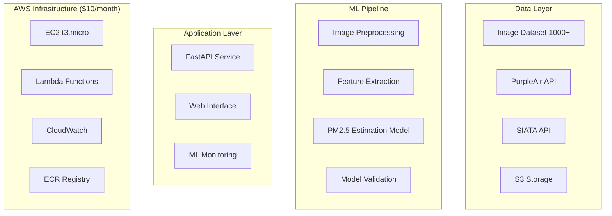

# GUÍA DEFINITIVA: PROYECTO 2.5VISION

## De Básico a ML Engineer Avanzado - Proyecto Insignia

---

## FILOSOFÍA DEL PROYECTO

### Objetivo Principal: 
Crear un sistema ML de clase mundial para estimación de PM2.5 que sirva como:
- Tu transición de básico a avanzado en ML Engineering
- Portfolio piece para atraer socios/inversión
- Contribución científica al monitoreo ambiental
- Plataforma de aprendizaje continuo

### Principios Guía:
- Learning-First: Cada decisión maximiza aprendizaje
- Portfolio-Ready: Documentación y arquitectura impresionante
- Cost-Efficient: $10/mes budget con escalabilidad futura
- Industry-Standard: Tecnologías demandadas en el mercado

---

## FASE 0: SETUP Y FUNDACIÓN ESTRATÉGICA (2-3 semanas)

### Semana 1: Research & Design

#### Día 1-2: Investigación Científica Profunda

##### Objetivo: Dominar el domain knowledge

###### Tareas de Investigación:
- Paper Review: Leer 10+ papers sobre PM2.5 estimation via images
- State-of-the-art: Identificar benchmarks actuales
- Feature Analysis: Entender qué features visuales correlacionan con PM2.5
- Uncertainty Quantification: Métodos para medir confianza en predicciones

###### Documentación Crítica:
```
# docs/scientific_background/
├── literature_review.md
├── feature_engineering_theory.md
├── benchmark_analysis.md
└── uncertainty_methods.md
```

#### Día 3-4: Arquitectura Definitiva

##### Diseño Técnico Completo:


##### Decisiones Arquitecturales Documentadas:
- ML Framework: PyTorch (vs TensorFlow) - Razón: Research flexibility
- Model Serving: TorchServe on EC2 (vs SageMaker) - Razón: Cost
- Feature Store: Custom SQLite (vs Feast) - Razón: Simplicity + Budget
- Monitoring: Custom + CloudWatch (vs MLflow) - Razón: Learning

#### Día 5-7: Technical Specification

##### Documento ADR (Architecture Decision Records):
```
# docs/architecture/ADRs/
├── 001-ml-framework-pytorch.md
├── 002-feature-store-sqlite.md
├── 003-deployment-strategy.md
├── 004-monitoring-approach.md
└── 005-data-pipeline-design.md
```

### Semana 2: Development Setup

#### Infraestructura como Código
```
# infrastructure/terraform/
├── main.tf
├── variables.tf
├── outputs.tf
└── modules/
    ├── ec2/
    ├── s3/
    └── cloudwatch/
```

##### Terraform para $10/mes:
```terraform
# EC2 t3.micro (Free tier eligible)
resource "aws_instance" "ml_server" {
  ami           = "ami-0abcdef1234567890"
  instance_type = "t3.micro"

  tags = {
    Name = "2.5Vision-ML-Server"
    Project = "2.5Vision"
  }
}

# S3 bucket con lifecycle policies
resource "aws_s3_bucket" "vision_data" {
  bucket = "2-5-vision-${random_string.bucket_suffix.result}"

  lifecycle_configuration {
    rule {
      id = "delete_old_objects"
      status = "Enabled"

      expiration {
        days = 30  # Controla costos
      }
    }
  }
}
```

### Semana 3: ML Foundation

#### Dataset Management Profesional

```python
# src/data/dataset_manager.py
class VisionDatasetManager:
    """
    Professional dataset management with versioning
    """
    def __init__(self, s3_bucket: str):
        self.s3 = boto3.client('s3')
        self.bucket = s3_bucket
        self.metadata_db = sqlite3.connect('datasets.db')

    def register_dataset(self,
                        version: str,
                        images: List[str],
                        labels: List[float]):
        """Register new dataset version"""
        dataset_hash = self._compute_hash(images, labels)

        # Store in S3
        dataset_path = f"datasets/v{version}/"
        self._upload_to_s3(dataset_path, images, labels)

        # Store metadata
        self._save_metadata(version, dataset_hash, len(images))

        return dataset_path
```

#### Data Validation Pipeline:
```python
# src/data/validators.py
@dataclass
class ImageValidationResult:
    is_valid: bool
    quality_score: float
    issues: List[str]
    metadata: Dict[str, Any]

class ImageQualityValidator:
    """Ensure image quality for ML training"""

    def validate_for_training(self, image_path: str) -> ImageValidationResult:
        image = cv2.imread(image_path)

        # Check resolution
        height, width = image.shape[:2]
        if width < 512 or height < 512:
            return ImageValidationResult(
                is_valid=False,
                quality_score=0.0,
                issues=["Resolution too low"],
                metadata={"width": width, "height": height}
            )

        # Check blur
        blur_score = self._measure_blur(image)

        # Check exposure
        exposure_score = self._measure_exposure(image)

        quality_score = (blur_score + exposure_score) / 2

        return ImageValidationResult(
            is_valid=quality_score > 0.7,
            quality_score=quality_score,
            issues=[],
            metadata={
                "blur_score": blur_score,
                "exposure_score": exposure_score
            }
        )
```

---

## FASE 1: ML CORE - BECOMING ML ENGINEER (6-8 semanas)

### Semana 4-5: Feature Engineering Científico

#### Advanced Computer Vision Features

```python
# src/ml/features/vision_features.py
class ScientificFeatureExtractor:
    """
    State-of-the-art feature extraction for atmospheric analysis
    """

    def extract_atmospheric_features(self, image: np.ndarray) -> Dict[str, float]:
        """
        Extract features correlated with PM2.5 based on atmospheric physics
        """
        features = {}

        # 1. Visibility-related features
        features.update(self._extract_visibility_features(image))

        # 2. Color distribution analysis
        features.update(self._extract_color_features(image))

        # 3. Texture analysis (atmospheric scattering patterns)
        features.update(self._extract_texture_features(image))

        # 4. Gradient analysis (horizon clarity)
        features.update(self._extract_gradient_features(image))

        # 5. Frequency domain analysis
        features.update(self._extract_frequency_features(image))

        return features

    def _extract_visibility_features(self, image: np.ndarray) -> Dict[str, float]:
        """Extract visibility-related features"""
        # Convert to LAB color space
        lab = cv2.cvtColor(image, cv2.COLOR_BGR2LAB)

        # Analyze L channel for visibility
        l_channel = lab[:, :, 0]

        return {
            'visibility_mean': np.mean(l_channel),
            'visibility_std': np.std(l_channel),
            'visibility_contrast': np.ptp(l_channel),
            'visibility_entropy': self._calculate_entropy(l_channel)
        }

    def _extract_texture_features(self, image: np.ndarray) -> Dict[str, float]:
        """GLCM and LBP features for atmospheric texture"""
        gray = cv2.cvtColor(image, cv2.COLOR_BGR2GRAY)

        # Gray Level Co-occurrence Matrix
        glcm = graycomatrix(gray, distances=[1], angles=[0], levels=256)

        # Local Binary Patterns
        lbp = local_binary_pattern(gray, P=24, R=3, method='uniform')

        return {
            'glcm_contrast': graycoprops(glcm, 'contrast')[0, 0],
            'glcm_dissimilarity': graycoprops(glcm, 'dissimilarity')[0, 0],
            'glcm_homogeneity': graycoprops(glcm, 'homogeneity')[0, 0],
            'lbp_uniformity': len(np.unique(lbp)) / (24 + 2)
        }
```

#### Feature Engineering Pipeline:
```python
# src/ml/pipeline/feature_pipeline.py
class FeaturePipeline:
    """Production-ready feature pipeline"""

    def __init__(self):
        self.extractors = [
            ScientificFeatureExtractor(),
            DeepFeatureExtractor(),  # CNN features
            MeteorologicalFeatureExtractor()  # Weather correlation
        ]
        self.scaler = StandardScaler()
        self.feature_selector = SelectKBest(f_regression, k=50)

    def fit_transform(self, images: List[np.ndarray],
                    targets: List[float]) -> np.ndarray:
        """Fit pipeline and transform features"""

        # Extract all features
        features = []
        for image in tqdm(images, desc="Extracting features"):
            image_features = {}
            for extractor in self.extractors:
                image_features.update(extractor.extract(image))
            features.append(list(image_features.values()))

        features = np.array(features)

        # Scale and select features
        features_scaled = self.scaler.fit_transform(features)
        features_selected = self.feature_selector.fit_transform(
            features_scaled, targets
        )

        # Store feature names for interpretability
        self.feature_names = self.feature_selector.get_feature_names_out()

        return features_selected
```

### Semana 6-7: Model Development & Training

#### Ensemble Learning Strategy

```python
# src/ml/models/ensemble_model.py
class PM25EnsembleModel:
    """
    Production ensemble for PM2.5 estimation
    """

    def __init__(self):
        self.models = {
            'xgboost': XGBRegressor(
                n_estimators=200,
                max_depth=6,
                learning_rate=0.1,
                random_state=42
            ),
            'lightgbm': LGBMRegressor(
                n_estimators=200,
                max_depth=6,
                learning_rate=0.1,
                random_state=42
            ),
            'neural_net': MLPRegressor(
                hidden_layer_sizes=(128, 64, 32),
                max_iter=500,
                random_state=42
            )
        }
        self.meta_learner = Ridge(alpha=1.0)

    def train(self, X: np.ndarray, y: np.ndarray,
            validation_split: float = 0.2):
        """Train ensemble with cross-validation"""

        # Split data
        X_train, X_val, y_train, y_val = train_test_split(
            X, y, test_size=validation_split, random_state=42
        )

        # Train base models
        predictions = np.zeros((len(X_val), len(self.models)))

        for idx, (name, model) in enumerate(self.models.items()):
            print(f"Training {name}...")

            # Cross-validation for base model
            cv_scores = cross_val_score(
                model, X_train, y_train, cv=5,
                scoring='neg_mean_squared_error'
            )
            print(f"{name} CV RMSE: {np.sqrt(-cv_scores.mean()):.3f}")

            # Train on full training set
            model.fit(X_train, y_train)

            # Predictions for meta-learner
            predictions[:, idx] = model.predict(X_val)

        # Train meta-learner
        self.meta_learner.fit(predictions, y_val)

        # Final ensemble prediction
        ensemble_pred = self.meta_learner.predict(predictions)
        ensemble_rmse = np.sqrt(mean_squared_error(y_val, ensemble_pred))

        print(f"Ensemble RMSE: {ensemble_rmse:.3f}")

        return ensemble_rmse
```

#### Uncertainty Quantification:
```python
# src/ml/uncertainty/bayesian_model.py
import torch
import torch.nn as nn
from torch.distributions import Normal

class BayesianNeuralNetwork(nn.Module):
    """
    Bayesian NN for uncertainty estimation
    """

    def __init__(self, input_dim: int):
        super().__init__()

        # Bayesian layers with weight uncertainty
        self.fc1 = BayesianLinear(input_dim, 128)
        self.fc2 = BayesianLinear(128, 64)
        self.fc3 = BayesianLinear(64, 1)

        self.dropout = nn.Dropout(0.1)

    def forward(self, x):
        x = torch.relu(self.fc1(x))
        x = self.dropout(x)
        x = torch.relu(self.fc2(x))
        x = self.dropout(x)
        mean = self.fc3(x)

        return mean

    def predict_with_uncertainty(self, x, n_samples=100):
        """Monte Carlo dropout for uncertainty"""
        self.train()  # Enable dropout

        predictions = []
        for _ in range(n_samples):
            pred = self.forward(x)
            predictions.append(pred.detach())

        predictions = torch.stack(predictions)

        mean = predictions.mean(dim=0)
        std = predictions.std(dim=0)

        return mean, std
```

### Semana 8: Model Validation & Metrics

#### Scientific Validation Pipeline

```python
# src/ml/evaluation/scientific_validation.py
class ScientificValidator:
    """
    Scientific validation beyond standard ML metrics
    """

    def comprehensive_evaluation(self,
                                model,
                                X_test: np.ndarray,
                                y_test: np.ndarray,
                                timestamps: List[datetime],
                                locations: List[Tuple[float, float]]):
        """Comprehensive model evaluation"""

        predictions = model.predict(X_test)

        # Standard ML metrics
        metrics = {
            'rmse': np.sqrt(mean_squared_error(y_test, predictions)),
            'mae': mean_absolute_error(y_test, predictions),
            'r2': r2_score(y_test, predictions),
            'mape': mean_absolute_percentage_error(y_test, predictions)
        }

        # Scientific validation
        metrics.update(self._temporal_consistency(
            predictions, y_test, timestamps
        ))
        metrics.update(self._spatial_consistency(
            predictions, y_test, locations
        ))
        metrics.update(self._physical_plausibility(predictions))

        # Error analysis
        errors = predictions - y_test
        metrics.update({
            'bias': np.mean(errors),
            'error_std': np.std(errors),
            'outlier_rate': np.sum(np.abs(errors) > 2 * np.std(errors)) / len(errors)
        })

        return metrics

    def _temporal_consistency(self, predictions, actual, timestamps):
        """Check temporal patterns consistency"""
        # Group by hour of day
        df = pd.DataFrame({
            'pred': predictions,
            'actual': actual,
            'hour': [t.hour for t in timestamps]
        })

        hourly_correlation = df.groupby('hour').apply(
            lambda x: x['pred'].corr(x['actual'])
        ).mean()

        return {'temporal_consistency': hourly_correlation}

    def _physical_plausibility(self, predictions):
        """Check physical plausibility of predictions"""
        # PM2.5 should be non-negative
        negative_rate = np.sum(predictions < 0) / len(predictions)

        # Check for unrealistic values (>500 μg/m³)
        extreme_rate = np.sum(predictions > 500) / len(predictions)

        return {
            'negative_prediction_rate': negative_rate,
            'extreme_prediction_rate': extreme_rate
        }
```

---

## FASE 2: PRODUCTION SYSTEM (4-6 semanas)

### Semana 9-10: Model Serving & APIs

#### Production Model Serving

```python
# src/api/model_service.py
from fastapi import FastAPI, UploadFile, HTTPException
import torch
from PIL import Image
import io

class ModelService:
    """Production model serving with monitoring"""

    def __init__(self):
        self.model = self._load_latest_model()
        self.feature_pipeline = self._load_feature_pipeline()
        self.metrics_collector = MetricsCollector()

    def _load_latest_model(self):
        """Load latest model from S3"""
        # Model versioning logic
        pass

    @torch.no_grad()
    async def predict(self, image_file: UploadFile) -> Dict[str, Any]:
        """Main prediction endpoint"""
        start_time = time.time()

        try:
            # Load and validate image
            image = Image.open(io.BytesIO(await image_file.read()))

            # Extract features
            features = self.feature_pipeline.transform([np.array(image)])

            # Get prediction with uncertainty
            mean, std = self.model.predict_with_uncertainty(
                torch.tensor(features, dtype=torch.float32)
            )

            prediction = {
                'pm25_estimate': float(mean.item()),
                'uncertainty': float(std.item()),
                'confidence': self._calculate_confidence(std.item()),
                'model_version': self.model.version,
                'processing_time': time.time() - start_time
            }

            # Log metrics
            await self.metrics_collector.log_prediction(
                prediction, image_file.filename
            )

            return prediction

        except Exception as e:
            await self.metrics_collector.log_error(str(e))
            raise HTTPException(status_code=500, detail=str(e))

app = FastAPI(title="2.5Vision API", version="1.0.0")
model_service = ModelService()

@app.post("/predict")
async def predict_pm25(file: UploadFile):
    return await model_service.predict(
```